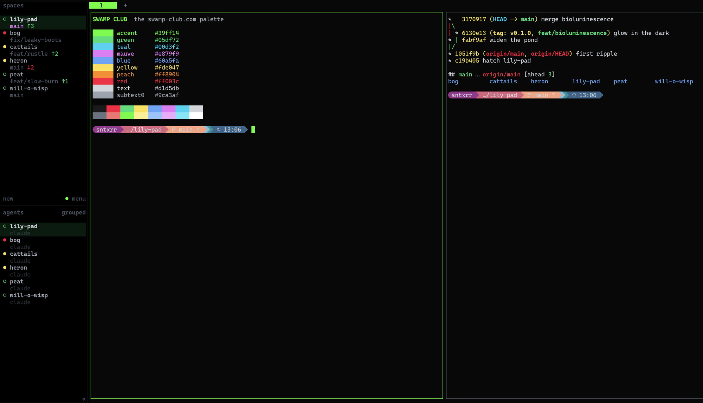
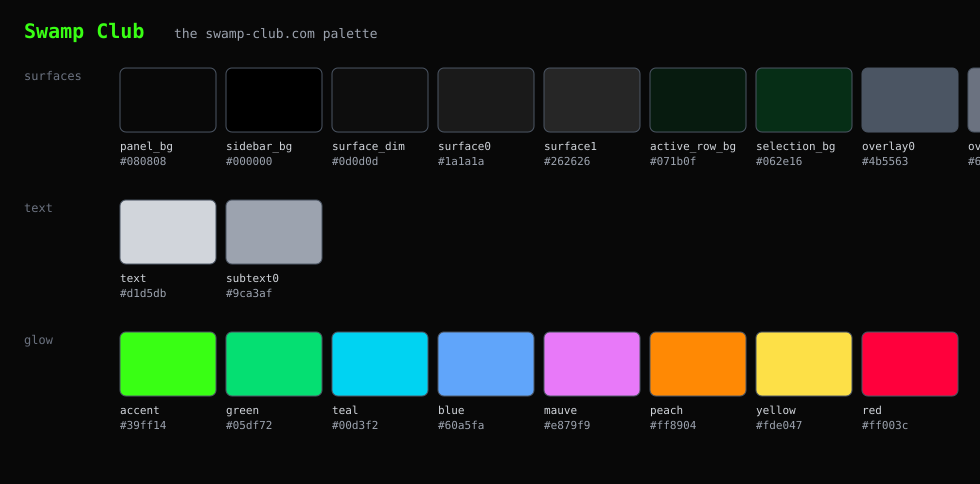

# Swamp Club — a theme for [herdr](https://herdr.dev)

The [swamp-club.com](https://swamp-club.com) palette: a pure-black canvas,
neutral gray text, a neon-green glow, and the site's cyan, magenta and
glitch-red for everything else.



There is a matching terminal theme so the panes and the sidebar read as one
surface: [ghostty-swamp-club](https://github.com/sntxrr/ghostty-swamp-club).

## Install

### One line

```sh
curl -fsSL https://raw.githubusercontent.com/sntxrr/herdr-swamp-club/main/install.sh | bash
```

That backs up `~/.config/herdr/config.toml` next to itself, replaces the
`[theme]` section with Swamp Club, installs the [sounds](#sounds), validates
the result, and reloads a running herdr. Nothing else in your config is
touched. Add `--no-sounds` for the colours alone. Add `--dry-run` to see the diff
first:

```sh
curl -fsSL https://raw.githubusercontent.com/sntxrr/herdr-swamp-club/main/install.sh | bash -s -- --dry-run
```

### By hand

1. Open `~/.config/herdr/config.toml`.
2. Delete your existing `[theme]` and `[theme.custom]` sections, if any.
   TOML allows each table once, so the new one can't simply be appended.
3. Paste in the contents of [`swamp-club.toml`](swamp-club.toml).
4. Reload:

   ```sh
   herdr server reload-config
   ```

   or press `prefix + shift + r` inside herdr.

## Uninstall

Restore the backup the installer wrote (or delete the two `[theme]` tables
and the two `# Swamp Club` lines under `[ui.sound]`) and reload:

```sh
cp ~/.config/herdr/config.toml.bak-<timestamp> ~/.config/herdr/config.toml
herdr server reload-config
```

## Palette



| role | token | value |
|---|---|---|
| black canvas → panels | `panel_bg` `sidebar_bg` `surface_dim` `surface0` `surface1` | `#080808` → `#262626` |
| focused row / navigate cursor | `active_row_bg` `selection_bg` | `#071b0f` `#062e16` |
| borders, dim glyphs | `overlay0` `overlay1` | `#4b5563` `#6b7280` |
| text / muted | `text` `subtext0` | `#d1d5db` `#9ca3af` |
| the glow | `accent` | `#39ff14` |
| done & ahead / working / needs attention & behind | `green` `yellow` `red` | `#05df72` `#fde047` `#ff003c` |
| wisps | `teal` `mauve` `blue` `peach` | `#00d3f2` `#e879f9` `#60a5fa` `#ff8904` |

`accent` and `green` are deliberately different: the neon marks focus and
highlights, while agent *done* states use the calmer green so a sidebar full
of finished agents doesn't glow.

## Sounds

Two short, soft chip-tune blips, with a nod to the hop in Frogger:

| when | file | sound |
|---|---|---|
| an agent finishes | [`sounds/done.mp3`](sounds/done.mp3) | two hops, then a bright landing chime |
| an agent needs you | [`sounds/request.mp3`](sounds/request.mp3) | a hop cut short by a buzzy splat and a cyan/magenta glitch |

swamp-club.com has no audio of its own, and none of Frogger's is used: both
are synthesized from scratch by [`sounds/make-sounds.py`](sounds/make-sounds.py)
(standard-library Python plus `lame`), so they can be tweaked and rebuilt.

The installer copies them to `~/.config/herdr/sounds/swamp-club-*.mp3` and
sets `done_path` / `request_path` under `[ui.sound]`. It leaves `enabled`,
any single `path`, and `[ui.sound.agents]` as you had them. herdr only plays
them for agents in background workspaces.

## Tweaks

Every value lives under `[theme.custom]` and can be changed on its own.
Three that people tend to want:

- **Too bright?** Swap `accent` for `#05df72` and `green` for `#39ff14`.
- **Panes should follow the terminal's background** rather than the theme's
  black: `panel_bg = "reset"`.
- **Dracula/Nord/… as the base** instead of catppuccin: change `name`.
  Every token is overridden, so the base only matters for anything herdr adds
  in a future version.

## Notes

- Requires herdr 0.9 or newer (`[theme.custom]` with per-token overrides).
- The palette is measured, with affection, from [swamp-club.com](https://swamp-club.com)
  (its compiled Tailwind v4 CSS and the live page's computed styles).
  This project is not affiliated with Swamp Club, Inc.
- MIT licensed.
